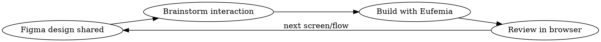

# Eufemia Kickstart

## Overview

Full prototyping workflow for designers using Claude Code. Gets from empty folder to iterating on Eufemia-based interaction prototypes with Figma input.

## When to Use

- Designer says "start a new prototype", "new project", "I want to build this interaction"
- Someone shares a Figma link and wants to make it interactive
- Beginning of a session where no project exists yet

## Required: Activate Eufemia Compliance

**IMMEDIATELY after this skill loads, invoke the `eufemia-web` skill.** This ensures all UI work follows Eufemia design tokens (spacing, colors, typography) from the start — not just the component library, but the full design system rules.

## Setup (One-Time)

Run these commands in sequence from an empty folder:

```bash
git init
npm create vite@latest . -- --template react-ts
npm install @dnb/eufemia
git add -A && git commit -m "Initial scaffold"
gh repo create $(basename $PWD) --private --source . --push
```

Then start the dev server:

```bash
npm run dev
```

## Create CLAUDE.md

After setup, write a minimal CLAUDE.md:

```markdown
# Project
Interaction prototype — not production code.
Stack: React + TypeScript + Vite + @dnb/eufemia

## Workflow
1. Receive Figma designs via MCP
2. Brainstorm interaction behavior before implementing
3. Build with Eufemia components
4. Iterate fast — no tests, no CI, no deployment
```

## Prototyping Loop



### Step 1: Receive Design

When a Figma link is shared, use `get_design_context` to pull the design. This gives you the layout, components, and screenshot to work from.

### Step 2: Brainstorm Interaction

**Always brainstorm BEFORE building.** Use the brainstorming skill to clarify:
- What states does this screen have? (empty, loading, error, success)
- What transitions happen on user actions?
- What edge cases matter for the prototype?

### Step 3: Build

- Use `@dnb/eufemia` components (Button, Input, Card, etc.)
- Keep files simple — one component per screen/flow
- No routing needed for single flows; add `react-router-dom` only if multiple pages

### Step 4: Review

Open `npm run dev` in browser. Test the interaction. Iterate.

## Common Mistakes

| Mistake | Fix |
|---------|-----|
| Over-engineering (routing, state management, tests) | This is a prototype. Keep it simple. |
| Skipping brainstorm, jumping straight to code | Interaction design > implementation speed |
| Using raw HTML instead of Eufemia components | Always check Eufemia docs first |
| Making it "production ready" | No tests, no CI, no deploy. Prototype only. |
